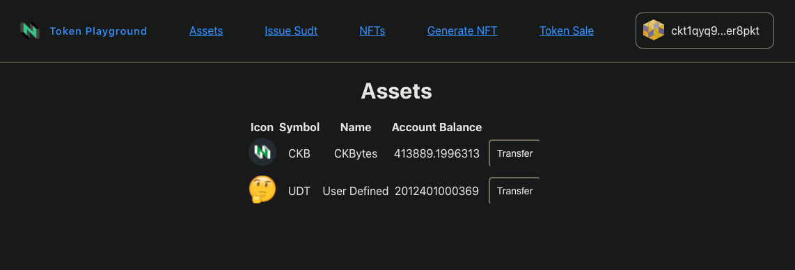

# Token Playground
A fully-featured Dapp to interact with tokens in the Nervos CKB ecosystem.
* Mint & transfer sUDTs
* Mint & transfer NFTs
* Run token sales

Learn more about the [architecture](./docs/architecture.md).
See the usage [guide](./docs/guide.md).

Based on the [Hello Lumos](https://github.com/tspoff/hello-lumos) dapp template.

# Install
1. Run `yarn install` in the root directory to install dependencies for both server & client.
___
## Configure
The client and server both need some env variables set to get started.

#### Client Config:
1. Navigate to the /client folder & copy `.env.example` -> `.env`. It's not necessary to change any values, if running a local testnet node as specified below.

#### Server Config:
1. Navigate to the /server folder & copy `.env.example` -> `.env`. Once again the standard values will work if following this guide directly.

# Run
1. Ensure a CKB node connected to Aggron4 testnet is running at the URI specified in the server `.env` config. ([guide to set up a local node](https://docs.nervos.org/docs/basics/guides/testnet))

2. Start server: 

    `yarn start` from /server folder

3. In a separate terminal, start client: 
    
    `yarn start` from /client folder

4. Navigate to `localhost:3000` in a browser. Use "Connect Wallet" to connect to one of the wallet options

Supported Wallets:
- [Synapse](https://github.com/rebase-network/synapse-extension)
- [MathWallet](https://mathwallet.org) (Coming Soon)

## Aside: Getting funds for Aggron 4 testnet.
If you need testnet CKB in order to interact with the dapp, take note of your wallet address and collect some from the faucet.

1. Click the wallet navbar to open up the wallet interface

2. Click the 'copy' modal to copy your address

3. Take that address to the [CKB Testnet Faucet](https://faucet.nervos.org/) & claim some testnet CKB

4. Once the transaction is processed, come back & refresh to see your new balance!