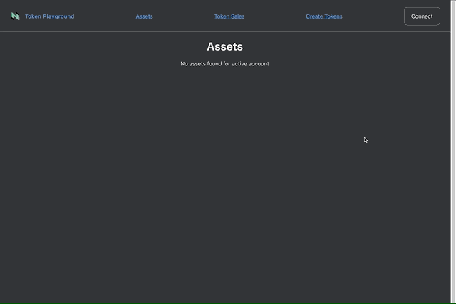

# Usage Guide
You must must first connect your wallet in order to interact with the dApp functionality. After connecting, the app will populate with the balances of your wallet. Currently only [Synapse](https://github.com/rebase-network/synapse-extension) support is up to date.

## Functionality Guides
* Mint & transfer sUDTs ([guide](./docs/sudt.md))
* Mint & transfer NFTs ([guide](./docs/nft.md))
* Run token sales ([guide](./docs/token-sale.md))