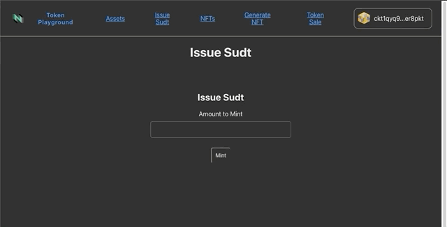

# sUDT Actions
Users can freely mint and transfer sUDTs.

## Transfer sUDTs
Go to /assets to see a list of the connected wallets' assets. It will list CKBytes, the users' sUDT, and any other sUDTs which are defined in the config.

## Mint sUDT
The owner of an sUDT can mint more of their own sUDT.
Fill in the amount to mint, and approve the transaction in your wallet. The pending transaction can be viewed below the form.

;
